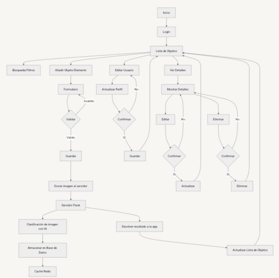
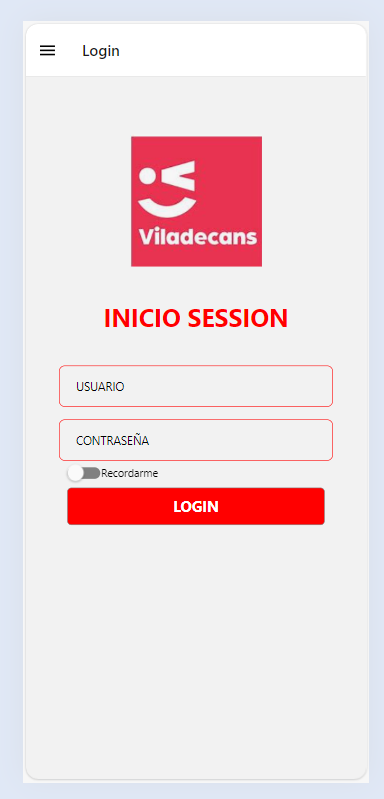

# ConstruHack 2024 - Aplicación de Economía Circular para Materiales Sobrantes de Obras Civiles
##  Guia de general de contenido
- Carpeta `/ai-docker-server`: contiene los archivos necesarios para ejecutar el servidor (en este caso, una [Raspberry Pi 4](https://www.raspberrypi.com/products/raspberry-pi-4-model-b/))
  - `dockerfile`: archivos necesarios para generar un sistema aislado con el modelo de IA para clasificar imágenes en el servidor.
  - Un script de Python que ejecuta todo el servidor.
- Carpeta `/docs`: incluye la documentación del proyecto, guías de usuario y especificaciones técnicas.
- Carpeta `/app`: contiene solo el archivo `index.tsx`, que es el punto de entrada principal de la aplicación.
- Carpeta `/src`: almacena los módulos de código base, funciones reutilizables y componentes de la aplicacion.
- Carpeta `/assets`: guarda imágenes, estilos y otros recursos estáticos utilizados en la aplicación.
## Descripción
Esta aplicación fue desarrollada en tan solo 3 días para la hackathon "ConstruHack 2024". Es un modelo para la presentación de una aplicación innovadora que promueve la economía circular en el sector de la construcción. Utilizando una base de datos de materiales sobrantes de obras civiles, la aplicación permite que estos recursos se reutilicen eficientemente en otros proyectos, reduciendo el excedente y fomentando la sostenibilidad en la industria de la construcción.
## Cómo funciona la aplicación


## Imagenes de la aplicacion



## Características
- Gestión de inventario de materiales sobrantes de obras civiles
- Sistema de búsqueda y filtrado para encontrar materiales reutilizables
- Plataforma para conectar proyectos con excedentes y aquellos que necesitan materiales
- Inicio de sesión de usuarios
- Añadir nuevos objetos al inventario de materiales reutilizables
- Visualización detallada de elementos disponibles
- Integración con IA para reconocimiento y categorización automática de materiales mediante fotografías

## Tecnologías Utilizadas
- React Native
- Expo
- Node.js
- Python (Flask)
- SQLite
- Redis
- PyTorch
- Pillow
- Docker

## Requisitos Previos
- Docker
- Android con Expo Go instalado

## Instalación

1. Clonar el repositorio:
   ```
   git clone https://github.com/AndreaKinder/construhack2024.git
   cd construhack2024
   ```

2. Construir y ejecutar el contenedor Docker para el backend:
   ```
   cd ./ai-docker-server
   docker build -t shape_classifier .
   docker run -d -p 5000:5000 shape_classifier
   ```

3. Instalar dependencias del frontend:
   ```
   npm install
   ```

4. Iniciar la aplicación:
   ```
   expo start --tunnel
   ```

5. Escanear el código QR con la app Expo Go en tu dispositivo Android.

## Uso
1. Inicie sesión en la aplicación.
2. Explore el inventario de materiales disponibles.
3. Utilice la función de búsqueda para encontrar materiales específicos.
4. Añada nuevos materiales sobrantes de su proyecto:
   - Tome una fotografía del material desde la aplicación.
   - El modelo de IA clasificará automáticamente el material.
   - El material se añadirá a la base de datos y se reflejará en tiempo real en la tabla de la aplicación.
5. Contacte con otros usuarios para coordinar la reutilización de materiales.

## Contribución
Dado que este proyecto fue desarrollado como parte de una hackathon, actualmente no estamos aceptando contribuciones externas. Sin embargo, apreciamos cualquier feedback o sugerencia para mejorar la idea.

## Licencia
Este proyecto está licenciado bajo la Licencia MIT. Consulte el archivo `LICENSE` para más detalles.

## Contacto
Andrea Villar - [andrea.villar@ejemplo.com]

Enlace del proyecto: [https://github.com/AndreaKinder/construhack2024](https://github.com/AndreaKinder/construhack2024)

## Agradecimientos
Agradecemos a los organizadores de ConstruHack 2024 por la oportunidad de desarrollar esta idea innovadora para promover la sostenibilidad en la industria de la construcción. Un agradecimiento especial a mis compañeros de equipo, Arnau y Roger, quienes se encargaron de la presentación del producto y el desarrollo de la idea de negocio. Su contribución fue fundamental para el éxito de este proyecto.
